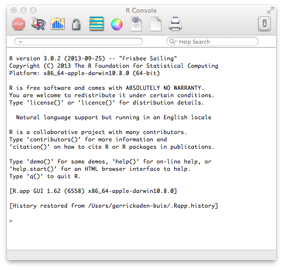
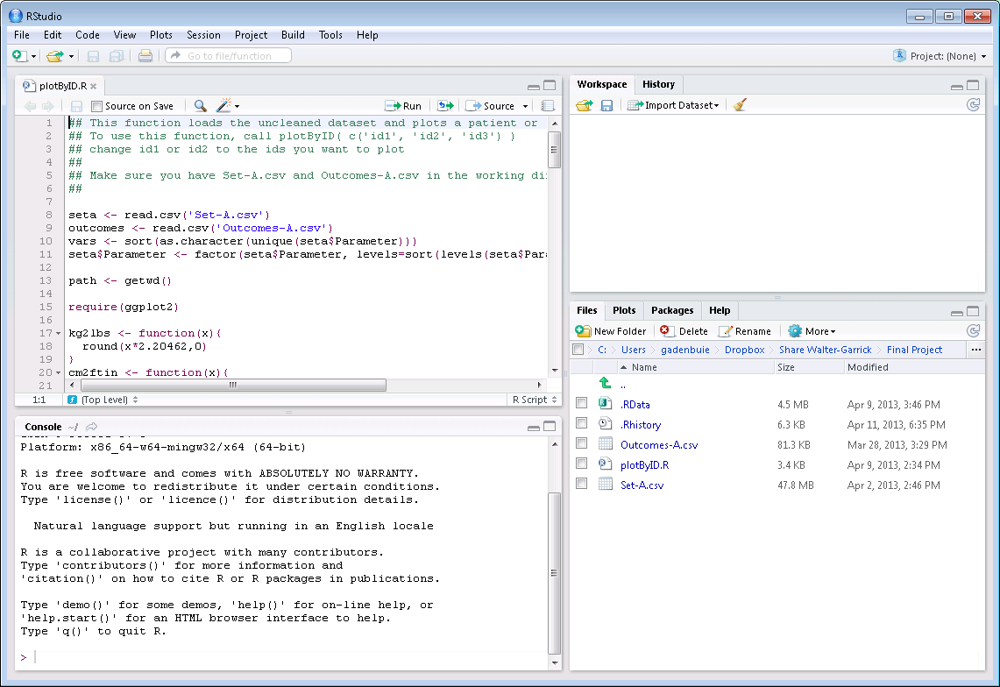

```{r xaringan-themer, include=FALSE, warning=FALSE}
library(tidyverse)
library(xaringanthemer)
style_duo_accent(primary_color = "#FF0000", secondary_color = "#001F3F" ,
                 background_color = "#f8f7f3",
                 header_font_google = google_font("Archivo"),
                 text_font_google   = google_font("Inconsolata"), 
                 link_color="#FFD700"
)
```
class: inverse,  middle


## Comenzaremos hablando de ...

- El universo R

- Primeros pasos en R


---
layout: false


## Lo necesario para comenzar
<br>

- Instalar **R**
    - [cloud.r-project.org](https://cloud.r-project.org/)
    
- Instalar **R-Studio** 
    - [rstudio.com](https://www.rstudio.com/)
    
- Descargar el código de esta presentación
    - [aquí](https://github.com/mebucca/data-analysis-in-R/blob/master/class_1.Rmd)
<br>


.img-right[]


---

class: fullscreen, left, middle, text-black
background-image: url("images/typewriter.jpg")

.huge[#Universo]
.huge[#R]

---

## Que es R?

<br>


- `R` es un lenguaje de programación de **código abierto y libre** para análisis estadístico y visualización de datos.

- Disponible para Windows, Mac y Linux

- Código libre y abierto

- R se amplia fácilmente a través de _paquetes_ ("packages") desarrollado por usuarios

---

## La Consola R



---

## R Studio




---

## Primeros pasos en R: 

```{r}
"Hola a todos!"
log(4+ exp(0))
4==7
```

---

## Packages

Instalar paquetes[*]

```r
install.packages('tidyverse')
```

Cargar paquetes (necesario para usarlo)

```r
library(tidyverse)
```

---

class: fullscreen,left, middle, text-black
background-image: url("images/typewriter.jpg")

.huge[#Funda]
.huge[#mentos]
.huge[#del]
.huge[#lenguaje]
.huge[#R]

---

## Operadores básicos

```r
2 + 2      # suma
2/2        # división
2*2        # multiplicación
2^2        # exponente
sqrt(2)    # raiz cuadrada
2 == 2     # evaluación lógica
2 <= 42    # evaluación lógica
2 != 42    # evaluación lógica
```

---

##Símbolos básicos

<br>

```{r}
x <- 7           # operador de asignación
y <- c(1,5,6,7)  # crear un vector
```

--

```{r}
print(y)         # imprimir un objeto  
rm(x)            # remover un objeto   
```


---

## Funciones

Las funciones tienen la forma `nombrefuncion(arg1, arg2, ...)` y los argumentos siempre van dentro del paréntesis.

Define una función:

.pull-left[
```{r}
mi_funcion <- function(x){
  resultado <- 2^x - 1/x #<<
  return(resultado)
}

mi_funcion(3)
```
]


---
class: inverse, center, middle

## ¡Muchas gracias!

<br>
Mauricio Bucca <br>
https://mebucca.github.io/ <br>
github.com/mebucca


