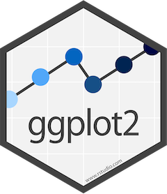
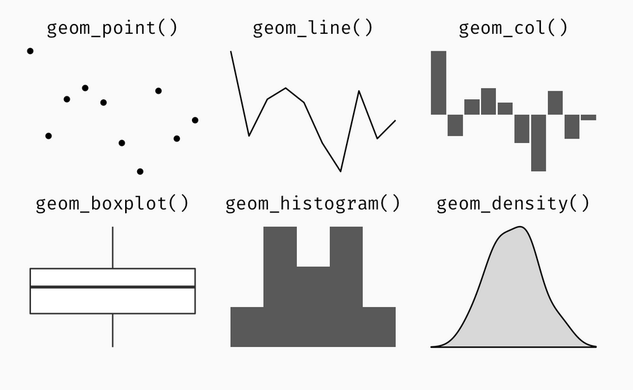
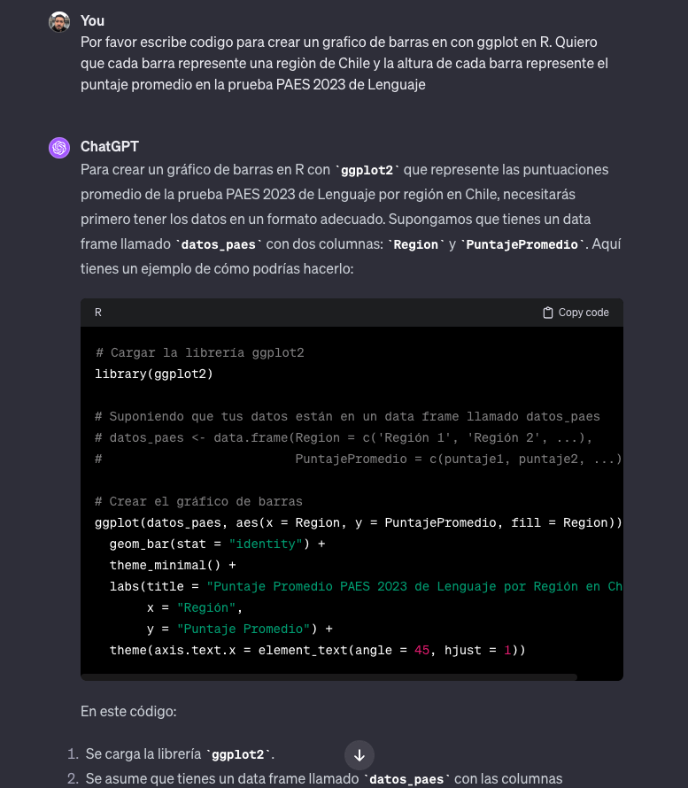

class: inverse, middle

```{r xaringan-themer, include=FALSE, warning=FALSE}
library(tidyverse)
library(xaringanthemer)
style_duo_accent(primary_color = "#6A0DAD", secondary_color = "#50C878",
                 background_color = "#f8f7f3",
                 header_font_google = google_font("Archivo"),
                 text_font_google   = google_font("Inconsolata"), 
                 link_color= "#E6E6FA"
)
```


## Finalizamos con ...

- Visualización de Datos


---

class: center, middle


---

class: fullscreen, left, middle, text-black
background-image: url("images/typewriter.jpg")

.huge[#ggplot2]

---
## ggplot2: un nueva forma de pensar y visualizar datos

<br>

.pull-left[
  
]

.pull-right[
`tidyr` permite:

- "Traduce" datos en elementos visuales 

]


---
## Bases de datos ordenadas ("tidy") 

- El punto de partida de un gráfico en `ggplot` es una base de datos "tidy".

--

- Si los datos no existen en el formato necesario para visualizarlos, necesitamos primero "darles forma". 

--

- Continuaremos trabajando con los datos de la prueba PAES 2023:

```{r, echo=FALSE, message=F, warning=F}
library("tidyverse") 
library("readr") 

setwd("/Users/Mauricio/Library/Mobile Documents/com~apple~CloudDocs/Teaching/ISUC/2024_1_nucleo_r2hs/data")

# leer archivo csv
datos_paes_2023 <- read_csv("paes_2023.csv")
```


---
class: inverse, center, middle

##tidyr::ggplot2()

--

###gg es por .bold[Grammar of Graphics]

---
##Gramática visual

<br>
Adivina los datos detrás del siguiente gráfico ...


.pull-right[
```{r, echo=FALSE, fig.height=6, warning=FALSE, message=FALSE}
g <- datos_paes_2023 %>% ggplot()
g
```
]

---
##Gramática visual

<br>
Adivina los datos detrás del siguiente gráfico ...

.pull-right[
```{r, echo=FALSE, fig.height=6, warning=FALSE, message=FALSE}
g <- datos_paes_2023 %>% ggplot() +
  aes(x=matematicas_1, y=matematicas_2)
g
```
]
---
##Gramática visual

<br>
Adivina los datos detrás del siguiente gráfico ...

.pull-right[
```{r, echo=FALSE, fig.height=6, warning=FALSE, message=FALSE}
g <- datos_paes_2023 %>% ggplot() +
  aes(x=matematicas_1, y=matematicas_2) +
  geom_point()
g
```
]

---
##Gramática visual

<br>
Adivina los datos detrás del siguiente gráfico ...

.pull-right[
```{r, echo=FALSE, fig.height=6, warning=FALSE, message=FALSE}
g <- datos_paes_2023 %>% ggplot() +
  aes(x=matematicas_1, y=matematicas_2, colour=dependencia) +
  geom_point()
g
```
]

---
##Gramática visual

<br>
Adivina los datos detrás del siguiente gráfico ...

.pull-right[
```{r, echo=FALSE, fig.height=6, warning=FALSE, message=FALSE}
g <- datos_paes_2023 %>% ggplot() +
  aes(x=matematicas_1, y=matematicas_2, colour=dependencia) +
  geom_point(alpha=0.3)
g
```
]

---
##Gramática visual

<br>
Adivina los datos detrás del siguiente gráfico ...

.pull-right[
```{r, echo=FALSE, fig.height=6, warning=FALSE, message=FALSE}
g <- datos_paes_2023 %>% ggplot() +
  aes(x=matematicas_1, y=matematicas_2, colour=dependencia) +
  geom_point(alpha=0.3) + 
  labs(x="Prueba de Matemáticas 1", y="Prueba de Matemáticas 2", colour = "Dependencia")
g
```
]


---
##Gramática visual

<br>
Adivina los datos detrás del siguiente gráfico ...

.center[
```{r, echo=FALSE, fig.height=6, fig.width=12, warning=FALSE, message=FALSE}
library(viridis)

g <- datos_paes_2023 %>% ggplot() +
  aes(x=matematicas_1, y=matematicas_2, colour=dependencia) +
  geom_point(alpha=0.3) + 
  labs(x="Prueba de Matemáticas 1", y="Prueba de Matemáticas 2", colour = "Dependencia") + 
  scale_color_viridis(discrete=TRUE) +
  theme_bw()
g
```
]


---
layout: false
# ¿Como "traducir" desde datos a objetivos visuales?

La gramática de gráficos consta de los siguientes elementos centrales:

<br>
--

.font120[
- **data** a visualizar
]

--
.font120[
- **.hlb[aes]thetic mappings:** estructura visual de datos
]

--
.font120[
- **.hlb[geom]etric objects**: indica qué se mostrará en el gráfico
]


---
class: inverse, center, middle

##Manos a la obra con ggplot2()

---
## gg Gramática de Gráficos: data

Datos de PAES 2023:

--

```{r, warning=FALSE, message=FALSE}
 datos_paes_2023
```


---
## gg Gramática de Gráficos: `geom_()`etría 

<br>

Dots (puntos)


.pull-left[
```{r  gg-geom, eval=FALSE,warning=FALSE, message=FALSE}

datos_paes_2023 %>% ggplot() +
  aes(x=matematicas_1, y=matematicas_2, 
      colour=dependencia) +
  geom_point() #<<

```
]

--
.pull-right[
```{r  gg-geom-out, ref.label="gg-geom", echo=FALSE, warning=FALSE, message=FALSE, fig.height=6}

```
]


---
## gg Gramática de Gráficos: `geom_()`etría 

Otras opciones recurrentes:

.center[


]


---
## gg Gramática de Gráficos: `geom_()`etría 

Y aún más opciones ...

.pull-left[
.font70[
```{r ggplot2-geom-names, echo=FALSE}
# geom_
old_width = options(width = 80)
lsf.str("package:ggplot2") %>% grep("^geom_", ., value = TRUE)
options(width = old_width$width)
```
 <http://ggplot2.tidyverse.org/reference/>
]
]

--

.img-right[

]


---
## gg Gramática de Gráficos: más sobre `aes()`thetic mappings


.pull-left[
```{r  gg-aes5, eval=FALSE,warning=FALSE, message=FALSE}
datos_paes_2023 %>% ggplot() +
  aes(x=matematicas_1, y=matematicas_2, 
      colour=dependencia) + #<<
geom_point()
```
]

--
.pull-right[
```{r  gg-aes5-out, ref.label="gg-aes5", echo=FALSE, warning=FALSE, message=FALSE, fig.height=6}

```
]


---
class: inverse, center, middle

##tidyr::ggplot2()

### Persanolización de apariencia

---
## Etiquetas


.pull-left[
```{r  gg-lab1, eval=FALSE,warning=FALSE, message=FALSE}
datos_paes_2023 %>% ggplot() +
  aes(x=matematicas_1, y=matematicas_2, 
      colour=dependencia) +
  geom_point() +
  labs(x="Prueba de Matemáticas 1",  #<< 
       y="Prueba de Matemáticas 2", #<< 
       colour = "Dependencia" #<< 
       )

```
]

--
.pull-right[
```{r  gg-lab1-out, ref.label="gg-lab1", echo=FALSE, warning=FALSE, message=FALSE, fig.height=6}
```
]


---
## Theme


.pull-left[
```{r  gg-theme1, eval=FALSE,warning=FALSE, message=FALSE}
datos_paes_2023 %>% ggplot() +
  aes(x=matematicas_1, y=matematicas_2, 
      colour=dependencia) +
  geom_point() +
  labs(x="Prueba de Matemáticas 1",  
       y="Prueba de Matemáticas 2", 
       colour = "Dependencia" 
       ) +
  theme_bw() #<<
```
]

--
.pull-right[
```{r  gg-theme1-out, ref.label="gg-theme1", echo=FALSE, warning=FALSE, message=FALSE, fig.height=6}
```
]


---
## Palette

.pull-left[
```{r  gg-palette2, eval=FALSE,warning=FALSE, message=FALSE}
library("viridis") #<<

datos_paes_2023 %>% ggplot() +
  aes(x=matematicas_1, y=matematicas_2, 
      colour=dependencia) +
  geom_point() +
  labs(x="Prueba de Matemáticas 1",  
       y="Prueba de Matemáticas 2", 
       colour = "Dependencia" 
       ) +
  theme_bw() +
  scale_color_viridis(discrete=TRUE, #<<
                      option="magma") #<<
```
]

--
.pull-right[
```{r  gg-palette2-out, ref.label="gg-palette2", echo=FALSE, warning=FALSE, message=FALSE, fig.height=6}
```
]


--
.pull-right[
```{r  gg-palette3-out, ref.label="gg-palette3", echo=FALSE, warning=FALSE, message=FALSE, fig.height=6}
```
]


---
class: fullscreen,left, top, top, text-azzurro
background-image: url("images/bicicleta.jpg")

.huge[#R se aprende]
.huge[#usando y]
.huge[#preguntando]

---

.bold[Chat-GPT puede ser un gran aliado!]



---
class: inverse, center, middle


##Gracias!


<br>
Mauricio Bucca <br>
https://mebucca.github.io/ <br>
github.com/mebucca


