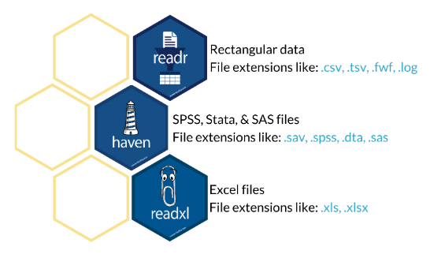
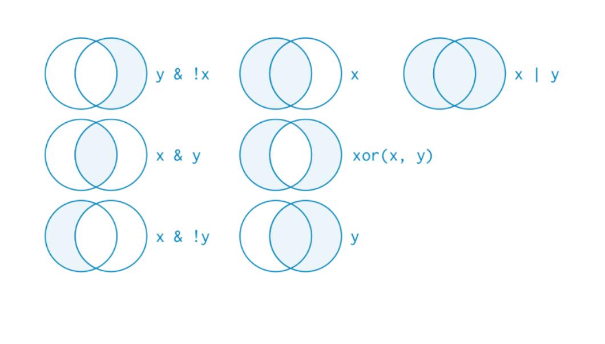

```{r xaringan-themer, include=FALSE, warning=FALSE}
library(tidyverse)
library(xaringanthemer)
style_duo_accent(primary_color = "#FF66B2", secondary_color = "#800020" ,
                 background_color = "#f8f7f3",
                 header_font_google = google_font("Archivo"),
                 text_font_google   = google_font("Inconsolata"), 
                 link_color="#F7D5CC"
)
```
class: inverse, middle


## Continuamos con ...

- Bases de datos

- Manipulación de datos


---
class: fullscreen, left, middle, text-black
background-image: url("images/typewriter.jpg")

#tidy
#verse

---
## Tidyverse y R-base

.center[]

---
## Universo tidyverse


.center[]


---
class: fullscreen, left, middle, text-black
background-image: url("images/typewriter.jpg")

.huge[#Importar]
.huge[#datos]


---


## readr, haven, readxl y más



---

## readr: cargar archivos .cvs

```{r, message=FALSE}
library("tidyverse") 
library("readr") 

setwd("/Users/Mauricio/Library/Mobile Documents/com~apple~CloudDocs/Teaching/ISUC/2024_1_nucleo_r2hs/data")

# leer archivo csv
datos_paes_2023 <- read_csv("paes_2023.csv")
```

--

```{r, message=FALSE, echo=FALSE}
datos_paes_2023 
```

---
class: fullscreen, left, middle, text-black
background-image: url("images/typewriter.jpg")

.huge[#Tibble]


---
## tibble: bases de datos ordenadas

<br>

.pull-left[

]

---
## Bases de datos ordenadas ("tidy")

Una bases de datos está ordenada si:

--

- Cada columna es una variable.

--

- Cada fila es una observación.

--

- Cada celda es un valor único.

<br>


---
class: fullscreen, left, middle, text-black
background-image: url("images/typewriter.jpg")

.huge[#Pipes]

---

.pull-left[
.huge[#magritte]

]

.pull-right[
.huge[#magrittr]

]

<br>
<br>

#### `%>%` es el operador pipe, contenido en el paquete `magrittr`

---

## ¿Cómo funciona `%>%`?

.pull-left[

]
.pull-right[
Simple:
```
Mario %>% 
  encuentra_gorro() %>% 
  toma_flor()
```
]


---
## ¿Cómo funciona `%>%`?

--

- La "tubería" (pipeline) debe siempre comezar con un objeto. Es decir, las funciones deben aplicarse sobre un argumento. Por ejemplo, el siguiente código no tiene sentido:  

  ```{r, eval=FALSE}
  encuentra_gorro() %>% Mario %>% toma_flor()
  ```

--
<br>

- El order en que se aplicar las funciones importa. Por ejemplo, las siguientes lineas de código tienen los mismo elementos pero producirían resultados distintos:

.pull-left[
  ```{r, eval=FALSE}
  persona %>% levantarse() %>% 
    ducharse() %>% vestirse()
  ```
]
.pull-right[ 
####resultado: persona en pie, vestida, seca
]

.pull-bottom[
.pull-left[
  ```{r, eval=FALSE}
  persona %>% levantarse() %>% 
    vestirse()  %>% ducharse()
  ```
]
.pull-right[
####resultado: persona en pie, vestida, mojada
]
]

---
## ¿Pipes? ¿Para qué?

Las "pipes" de `tidyverse` permiten un flujo sencillo y ordenado en la manipulación de datos:

--


```{r, eval=FALSE}
datos_paes_2023 %>%
  select(mrun,colegio,dependencia,comuna,matematicas_2) %>%
  filter(dependencia == "Público") %>%
  arrange(desc(matematicas_2)) 
```
--

```{r, echo=FALSE}
datos_paes_2023 %>%
  select(mrun,colegio,dependencia,comuna,matematicas_2) %>%
  filter(dependencia == "Público") %>%
  arrange(desc(matematicas_2)) 
```


---

class: fullscreen, left, middle, text-black
background-image: url("images/typewriter.jpg")

.huge[#dplyr]

---

## dplyr: herramientas intuitivas para manipulación de datos

<br>

.pull-left[
  
]

.pull-right[
`dplyr` permite:

- ordenar datos

- filtrar casos 

- seleccionar variables

- crear y transformar variables

- agrupar datos

- crear resumen estadísticos
]


---
class: inverse, center, middle

.huge[
##select()
]

---

## select: selección de variables

La función `select()` permite reterner un sub-conjunto de las variables presentes en la base de datos.

Supongamos que sólo estamos interesados en trabajar con las variables `sexo`,`edad` y `educ`. Podemos retener sólo estas tres variables usando la función `select()`.
 
--

```{r}
datos_paes_2023 %>% select(colegio,dependencia,matematicas_1)
```


---
class: inverse, center, middle

.huge[
##filter()
]

---

## filter: selección de variables

La función `filter()` permite reterner el sub-conjunto de observaciones que cumple con las condiciones especificadas por el usuario. 

--

Supongamos que sólo estamos interesados en estudiantes de colegio particulares pagados. Podemos retener este sub-conjunto de filas usando la función `filter()`. 

--

```{r}
datos_paes_2023 %>% filter(dependencia=="Particular Pagado")
```

---
## filter: operadores de comparación

Podemos seleccionar observaciones usando los operadores matemáticos para evaluar igualdad/desigualdad y operaciones lógicas.

* Negación (o complemento): alumnos de todos los colegios menos particulares

```{r, eval=FALSE}
  datos_paes_2023 %>% filter(dependencia!="Particular Pagado")
```

--

* Desigualdad y conjunción: solo mujeres con más de 700 puntos en lenguaje 

```{r, eval=FALSE}
  datos_paes_2023 %>% filter(sexo=="Mujer" & lenguaje>700)
```

--

* Muchas otras posibilidades

---
## filter: operadores lógicos



---
class: inverse, center, middle


##mutate()


---
## mutate: creación de datos

Supongamos que queremos crear una nueva variable que calcule el puntaje promedio en las tres pruebas obligatorias:

--

```{r, message=FALSE}
datos_paes_2023 <- datos_paes_2023 %>% 
  mutate(puntaje_total = (lenguaje + matematicas_1 + matematicas_2)/3)
```

--

```{r, echo=FALSE}
datos_paes_2023
```

---
class: inverse, center, middle

##group_by()


---
## group_by: operaciones agrupadas.

Supongamos que queremos agregar un nueva variable que calcule el promedio en la prueba de matemáticas 1 por dependencia. `group_by()` es una herramienta muy conveniente para realizar este tipo de operaciones.

--

```{r}
datos_paes_2023 %>% 
  group_by(dependencia) %>% #<<
  mutate(promedio_mat1_dependencia = mean(matematicas_1, na.rm=T))  %>% #<<
  select(mrun,dependencia,matematicas_1,promedio_mat1_dependencia)
```

---
class: inverse, center, middle


##summarise()

---
## summarise: extrayendo información de los datos

<br>

La función `summarise()` permite calcular una variedad de medidas en base a los datos. 

--

- Una de las principales ventajas es que esta función retorna una base de datos con los resultados, que puede ser usado para posterior análisis (ej, gráficos).

--

- Combinando con `group_by()` resulta una herramiendo muy potente. 


---
## summarise: extrayendo información de los datos

Crea una nueva base de datos que contiene promedio en la prueba de matemáticas 1 por dependencia y sexo:

```{r, message=FALSE}
library(tidyverse)
datos_paes_2023 %>% 
  group_by(dependencia,sexo) %>% #<<
  summarise(promedio_dependencia = mean(matematicas_1, ra.rm=T))  #<<
```

Obtenemos una bases de datos con los resultados.


---
class: inverse, center, middle


##Gracias!

<br>
Mauricio Bucca <br>
https://mebucca.github.io/ <br>
github.com/mebucca


